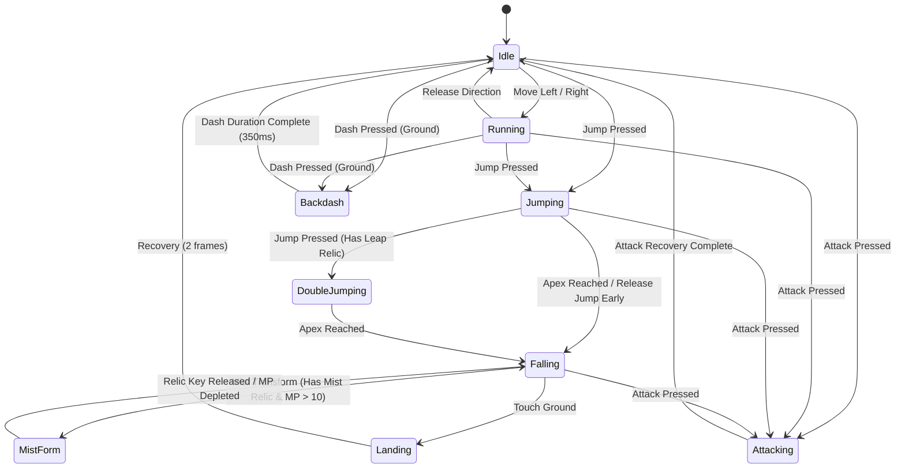

# Software Design Document (SDD)
# Eclipse of the Sanguine Throne
**A Web-Based Metroidvania × Asynchronous Castle-Building Action RPG**

---

## Document Metadata
- **Project Title:** Eclipse of the Sanguine Throne
- **Document Version:** 1.0.0
- **Target Platform:** Modern Web (Desktop & Mobile Web, WebGL / HTML5 Canvas)
- **Primary Tech Stack:** Phaser 3, Vite, TypeScript, Node.js / Cloud Serverless
- **Author/Architecture Reference:** Antigravity System Architecture Team
- **Date:** September 2026

---

## 1. Executive Summary & Vision

### 1.1 High Concept
*Eclipse of the Sanguine Throne* merges the tight, gothic 2D action platforming of **Castlevania: Symphony of the Night (SotN)** with the asynchronous base-building, defense optimization, and strategic raiding loop of **Clash of Clans**.

Players assume the dual role of **Vampire Lord** and **Dungeon Architect**:
1. **The Architect (Build):** Construct an intricate, sprawling castle lair utilizing traps, gothic architecture, monster summoning chambers, sealed relic doors, and defensive gargoyles to safeguard your Castle Heart and Blood Vaults.
2. **The Raider (Infiltrate):** Personally invade rival lords' player-built castles in real-time 2D side-scrolling combat. Slay summoned beasts, disarm and evade lethal traps, uncover secrets, and breach the rival Castle Core before time or your vitality expires.
3. **The Lord (Progression):** Harvest Sanguine Essence and Dark Gold from successful raids to unlock ancient relics (Double Jump, Mist Form, Bat Flight), summon higher-tier monsters, craft cursed weapons, and expand castle grid capacity.

### 1.2 Core Pillars
1. **Precision SotN Platforming & Combat:** Uncompromising fluid controls featuring variable jump arcs, signature backdashes with invulnerability frames (i-frames), frame-accurate sword swings, and aerial fluidity.
2. **Creative Asynchronous Defense:** Castle defense is emergent. Players build labyrinthine layouts, combo traps (e.g., knockback pendulums launching invaders into spike pits), and patrol routes.
3. **Guaranteed Solvability (Proof of Victory):** To eliminate "impossible bases," a player must personally clear their own castle from entrance to Castle Core under standard raid conditions before publishing it to the matchmaking pool.
4. **Web-First Instant Playability:** Zero-install web experience built on Vite + TypeScript + Phaser 3, optimized for instantaneous hot-reloading, deterministic physics, and lightweight asset streaming.

---

## 2. System Architecture & High-Level Design

### 2.1 System Architecture Diagram

```mermaid
graph TB
    subgraph Client ["Client Application (Phaser 3 + TypeScript + Vite)"]
        UI["DOM / UI Overlay Layer (HUD, Modals, Menus)"]
        Engine["Phaser 3 Game Instance"]
        
        subgraph Scenes ["Phaser Scene Manager"]
            Boot["Boot & Preload Scene"]
            Title["Title & Sanctuary Scene"]
            Architect["Castle Architect Scene (Editor Mode)"]
            Raid["Raid Infiltration Scene (Play Mode)"]
            Validation["Castle Validation Scene (Test Run)"]
            Summary["Post-Raid Debrief Scene"]
        end

        subgraph CoreSystems ["Core Client Subsystems"]
            InputMgr["Input Manager (Keyboard / Gamepad)"]
            PlayerController["Player Controller & State Machine"]
            CombatEngine["Hitbox & Damage Engine"]
            TilemapRenderer["Dynamic Tilemap & Room Renderer"]
            EntityManager["Entity & AI Spawner System"]
            ReplayRecorder["Input & Telemetry Recorder"]
        end
    end

    subgraph Backend ["Backend & Cloud Infrastructure (Node.js / Go)"]
        API["REST / WebSocket API Gateway"]
        AuthService["Authentication & Profile Service"]
        CastleService["Castle Map Repository & Schema Validator"]
        Matchmaking["Matchmaker & Raid Arbiter"]
        ReplayVerifier["Headless Deterministic Replay Verifier"]
        Database[("PostgreSQL / Document Store (Maps & Profiles)")]
    end

    UI --> Engine
    Engine --> Scenes
    Scenes --> CoreSystems
    Client <-->|REST / JSON| API
    API --> AuthService
    API --> CastleService
    API --> Matchmaking
    API --> ReplayVerifier
    CastleService --> Database
    Matchmaking --> Database
```



### 2.2 Client-Side Component Breakdown
- **Phaser 3 Framework:** Drives WebGL/Canvas rendering, Arcade Physics, texture atlas animations, audio playback, and camera control.
- **Dynamic Tilemap Engine:** Converts serialized `PlayerCastleMap` JSON schemas into runtime Phaser tilemap layers (`CollisionLayer`, `BackgroundLayer`, `HazardLayer`).
- **Entity Lifecycle Manager:** Manages active monster AI, trap triggers, doors, items, and particle emitters based on player camera proximity.
- **Input & Telemetry Recorder:** Captures timestamped player controller inputs during raids for asynchronous replay generation and anti-cheat validation.

---

## 3. Core Gameplay & Metroidvania Mechanics

### 3.1 Player Controller & State Machine

The player character (Alucard archetype) features state-driven physics modeled after *Symphony of the Night*:



#### Movement & Physics Constants
| Parameter | Value | Unit / Description |
|:---|:---|:---|
| `WALK_SPEED` | `180` | px/sec |
| `RUN_SPEED` | `240` | px/sec |
| `GRAVITY` | `980` | px/sec² |
| `INITIAL_JUMP_VELOCITY` | `-360` | px/sec (Variable jump: cut velocity to 40% if released early) |
| `DOUBLE_JUMP_VELOCITY` | `-320` | px/sec (Unlocked via *Leap Stone* relic) |
| `BACKDASH_VELOCITY` | `-420` | px/sec (Opposite of facing direction, active 350ms) |
| `BACKDASH_I_FRAMES` | `180` | ms of complete invulnerability upon activation |
| `COYOTE_TIME` | `100` | ms window to jump after stepping off a platform edge |
| `JUMP_BUFFER` | `120` | ms window to queue jump before touching ground |

### 3.2 Combat & Hitbox Engine
Combat utilizes a decoupled hitbox/hurtbox lifecycle to ensure deterministic hit registration:
- **Melee Arc:** When an attack triggers, a transient sensor shape is instantiated across specific animation keyframes (frames 3–5 of sword slash).
- **Damage Formula:**
  $$\text{Damage} = \max\left(1, (\text{Attacker ATK} \times \text{Skill Multiplier}) - \text{Defender DEF}\right)$$
- **Damage Flash & Knockback:** Targets receiving damage trigger an 8-frame white tint flash and enter hitstun with directional knockback ($\vec{v} = (\pm 140, -180)$).
- **Sub-Weapons:** Consumes Hearts (ammo resource):
  - *Dagger:* Rapid straight-line piercing projectile.
  - *Holy Water:* Ground-shattering fire patch dealing persistent tick damage.
  - *Axe:* High parabolic arc projectile bypassing shields and high walls.

---

## 4. Castle Architect & Raiding System (Base Building)

### 4.1 The Core Tri-Loop
1. **BUILD (Architect View):**
   - 2D grid-based level editor.
   - Place platforms, stairways, locked relic doors, secret breakable walls.
   - Install traps (spike floors, pendulums, gargoyle flame spitters, arrow slits).
   - Assign monster spawners with programmable patrol zones.
   - Position **Blood Wells** (Gold/Resource extractors) and the **Castle Core** (Town Hall).
2. **VALIDATE (Proof of Victory):**
   - Before a castle can go live, the architect must infiltrate their own castle from entrance to the Castle Core.
   - Abilities are constrained to the current tier; no developer cheats or god mode permitted.
   - Successful run calculates a **Par Solvability Score** and enables public deployment.
3. **RAID (Metroidvania Action View):**
   - Players select rival player castles from the Sanguine Ledger (Matchmaking).
   - Enter as an invader under a 4-minute time limit.
   - Earn stars:
     - $\star$ **1 Star:** Slay at least 50% of castle defenders or loot Blood Wells.
     - $\star\star$ **2 Stars:** Destroy the Guardian Boss Room.
     - $\star\star\star$ **3 Stars:** Shatter the Castle Core (Heart of Dracula).
4. **UPGRADE & EXPAND:**
   - Resources earned from raids upgrade the player's Castle Core level.
   - Higher core tiers expand map grid dimensions ($60\times 30 \rightarrow 120\times 60$), increase placement budget, and unlock deeper Metroidvania relics.

### 4.2 Clash of Clans to 2D Metroidvania Mapping

| Clash of Clans Feature | *Eclipse of the Sanguine Throne* Counterpart | Function in 2D Metroidvania |
|:---|:---|:---|
| **Town Hall** | **Castle Core (Heart of Dracula)** | Central objective room. Destroying it grants 3-star victory & maximum trophy yield. |
| **Walls** | **Portcullises, Iron Grates & Breakable Masonry** | Gates passage. Requires finding keys, lever switches, or wall-breaking bombs. |
| **Cannons / Archer Towers** | **Ballistas, Pendulum Traps & Flame Gargoyles** | Automated defenses triggering on player proximity or cyclic timers. |
| **Traps (Bombs, Spring)** | **Spike Pits, Crushing Ceilings & Fake Floors** | Hidden or reactive hazards punishing reckless platforming. |
| **Troop Barracks** | **Monster Summoning Sigils** | Spawns skeletons, flying bats, flea riders, and axe knights. |
| **Clan Castle / Clan Troops** | **Crypt Guardian (Player-Trained Boss)** | High-tier boss monster (Minotaur, Succubus, or Dullahan) defending the Core. |
| **Shield / Guard Period** | **Lunar Eclipse Ward** | Castle cannot be raided for 12 hours after sustaining a 3-star breach. |

---

## 5. Data Architecture & JSON Schema

### 5.1 JSON Schema: `PlayerCastleMap`
The castle map layout is serialized as a strongly-typed JSON structure:

```json
{
  "$schema": "https://json-schema.org/draft/2020-12/schema",
  "title": "PlayerCastleMap",
  "type": "object",
  "required": [
    "mapId",
    "ownerId",
    "version",
    "gridWidth",
    "gridHeight",
    "tileSize",
    "budgetUsed",
    "maxBudget",
    "spawnPoint",
    "castleCore",
    "layers",
    "entities",
    "checksum"
  ],
  "properties": {
    "mapId": { "type": "string", "format": "uuid" },
    "ownerId": { "type": "string" },
    "castleName": { "type": "string", "maxLength": 48 },
    "version": { "type": "integer", "minimum": 1 },
    "tier": { "type": "integer", "minimum": 1, "maximum": 10 },
    "gridWidth": { "type": "integer", "minimum": 20, "maximum": 160 },
    "gridHeight": { "type": "integer", "minimum": 15, "maximum": 90 },
    "tileSize": { "type": "integer", "enum": [16, 32] },
    "budgetUsed": { "type": "integer", "minimum": 0 },
    "maxBudget": { "type": "integer", "minimum": 100 },
    "spawnPoint": {
      "type": "object",
      "required": ["x", "y"],
      "properties": {
        "x": { "type": "integer", "minimum": 0 },
        "y": { "type": "integer", "minimum": 0 }
      }
    },
    "castleCore": {
      "type": "object",
      "required": ["x", "y", "health", "tier"],
      "properties": {
        "x": { "type": "integer", "minimum": 0 },
        "y": { "type": "integer", "minimum": 0 },
        "health": { "type": "integer", "minimum": 500 },
        "tier": { "type": "integer", "minimum": 1, "maximum": 10 }
      }
    },
    "layers": {
      "type": "object",
      "required": ["background", "collision", "hazard"],
      "properties": {
        "background": {
          "type": "array",
          "items": { "type": "integer" },
          "description": "Flat row-major array of tile IDs for decorative background."
        },
        "collision": {
          "type": "array",
          "items": { "type": "integer" },
          "description": "Flat row-major array: 0 = Empty, 1 = Solid, 2 = One-Way Platform, 3 = Breakable Wall."
        },
        "hazard": {
          "type": "array",
          "items": { "type": "integer" },
          "description": "Flat row-major array: 0 = Safe, 1 = Instant Spike, 2 = Toxic Slime, 3 = Electric Grid."
        }
      }
    },
    "entities": {
      "type": "array",
      "items": {
        "type": "object",
        "required": ["instanceId", "type", "x", "y"],
        "properties": {
          "instanceId": { "type": "string" },
          "type": {
            "type": "string",
            "enum": [
              "spawner_skeleton",
              "spawner_bat",
              "spawner_axe_armor",
              "trap_pendulum",
              "trap_ballista",
              "trap_flame_gargoyle",
              "door_iron_grate",
              "door_relic_lock",
              "switch_pressure_plate",
              "switch_lever",
              "vault_blood_well",
              "boss_crypt_guardian"
            ]
          },
          "x": { "type": "integer" },
          "y": { "type": "integer" },
          "properties": {
            "type": "object",
            "properties": {
              "patrolRadius": { "type": "integer" },
              "triggerTargetId": { "type": "string" },
              "requiredRelic": { "type": "string", "enum": ["DoubleJump", "MistForm", "BatFlight", "IronKey"] },
              "fireInterval": { "type": "number" },
              "facing": { "type": "string", "enum": ["left", "right", "up", "down"] }
            }
          }
        }
      }
    },
    "checksum": {
      "type": "string",
      "description": "HMAC SHA-256 validation hash computed on base publication."
    }
  }
}
```

### 5.2 TypeScript Interfaces

```typescript
export interface Point2D {
  x: number;
  y: number;
}

export interface CastleCoreData extends Point2D {
  health: number;
  tier: number;
}

export type EntityType =
  | 'spawner_skeleton'
  | 'spawner_bat'
  | 'spawner_axe_armor'
  | 'trap_pendulum'
  | 'trap_ballista'
  | 'trap_flame_gargoyle'
  | 'door_iron_grate'
  | 'door_relic_lock'
  | 'switch_pressure_plate'
  | 'switch_lever'
  | 'vault_blood_well'
  | 'boss_crypt_guardian';

export interface EntityConfig {
  instanceId: string;
  type: EntityType;
  x: number;
  y: number;
  properties?: {
    patrolRadius?: number;
    triggerTargetId?: string;
    requiredRelic?: 'DoubleJump' | 'MistForm' | 'BatFlight' | 'IronKey';
    fireInterval?: number;
    facing?: 'left' | 'right' | 'up' | 'down';
  };
}

export interface CastleLayers {
  background: number[];
  collision: number[];
  hazard: number[];
}

export interface PlayerCastleMap {
  mapId: string;
  ownerId: string;
  castleName: string;
  version: number;
  tier: number;
  gridWidth: number;
  gridHeight: number;
  tileSize: 16 | 32;
  budgetUsed: number;
  maxBudget: number;
  spawnPoint: Point2D;
  castleCore: CastleCoreData;
  layers: CastleLayers;
  entities: EntityConfig[];
  checksum: string;
}
```

---

## 6. Phaser 3 Engine Implementation Specifications

### 6.1 Scene Hierarchy & Transitions
- **`BootScene`:** Initializes asset loaders, parses display ratios, applies `pixelArt: true` rendering mode.
- **`PreloadScene`:** Loads sprite atlases (Alucard spritesheet, gothic castle tileset, monsters, audio stems).
- **`SanctuaryScene`:** Metagame hub displaying Lord stats, tech tree, Sanguine Ledger (matchmaking), and trophy count.
- **`CastleArchitectScene`:** 2D interactive editor for constructing, modifying, and budgeting player castles.
- **`CastleValidationScene`:** Solvability test scene running full game physics to prove map feasibility.
- **`RaidScene`:** Real-time action infiltration of another player's castle with countdown timer, star scoring, and boss fight.
- **`RaidSummaryScene`:** Post-battle breakdown showing damage dealt, resources looted, and replay status.

### 6.2 Level Loader & Dynamic Tilemap Construction

```typescript
export class CastleLevelLoader {
  private scene: Phaser.Scene;
  private mapData: PlayerCastleMap;
  public tilemap!: Phaser.Tilemaps.Tilemap;
  public collisionLayer!: Phaser.Tilemaps.TilemapLayer;
  public hazardLayer!: Phaser.Tilemaps.TilemapLayer;

  constructor(scene: Phaser.Scene, mapData: PlayerCastleMap) {
    this.scene = scene;
    this.mapData = mapData;
  }

  public buildLevel(): void {
    const { gridWidth, gridHeight, tileSize, layers } = this.mapData;

    // 1. Create Phaser Tilemap container
    this.tilemap = this.scene.make.tilemap({
      tileWidth: tileSize,
      tileHeight: tileSize,
      width: gridWidth,
      height: gridHeight,
    });

    const tileset = this.tilemap.addTilesetImage('gothic_castle_tileset', 'castle_tiles');
    if (!tileset) throw new Error('Tileset failed to load');

    // 2. Render Background Layer
    const bgLayer = this.tilemap.createBlankLayer('BackgroundLayer', tileset);
    this.populate2DGrid(bgLayer, layers.background, gridWidth);

    // 3. Render Solid Collision Layer
    this.collisionLayer = this.tilemap.createBlankLayer('CollisionLayer', tileset)!;
    this.populate2DGrid(this.collisionLayer, layers.collision, gridWidth);
    this.collisionLayer.setCollisionByExclusion([-1, 0]);

    // 4. Render Hazard Layer
    this.hazardLayer = this.tilemap.createBlankLayer('HazardLayer', tileset)!;
    this.populate2DGrid(this.hazardLayer, layers.hazard, gridWidth);
    this.hazardLayer.setCollisionByExclusion([-1, 0]);

    // 5. Set World & Camera Bounds
    this.scene.physics.world.setBounds(0, 0, gridWidth * tileSize, gridHeight * tileSize);
    this.scene.cameras.main.setBounds(0, 0, gridWidth * tileSize, gridHeight * tileSize);
  }

  private populate2DGrid(layer: Phaser.Tilemaps.TilemapLayer | null, data: number[], width: number): void {
    if (!layer) return;
    for (let index = 0; index < data.length; index++) {
      const tileIndex = data[index];
      if (tileIndex > 0) {
        const x = index % width;
        const y = Math.floor(index / width);
        layer.putTileAt(tileIndex, x, y);
      }
    }
  }
}
```

### 6.3 Architect Editor Tooling & Budget Validation
- **Grid Placement Brush:** Places solid tiles, platforms, or hazards at current cursor tile coordinate with instant budget deduction.
- **Budget Pricing Rules:**
  - Standard Stone Tile: `1 Budget Point`
  - Spike / Toxic Hazard: `3 Budget Points`
  - Skeleton Spawner: `15 Budget Points`
  - Axe Armor Knight Spawner: `40 Budget Points`
  - Relic Door + Key: `35 Budget Points`
  - Flame Gargoyle Trap: `25 Budget Points`
  - Crypt Guardian Boss: `150 Budget Points` (Max 1 per castle)

---

## 7. Network, Matchmaking & Anti-Cheat

### 7.1 Matchmaking & Ledger Architecture
- Castles are categorized into **Trophy Tiers** based on defensive win/loss records.
- Attackers are matched with bases matching their Hero Level and Relic Capacity ($\pm 1$ tier).
- **Lunar Eclipse Shield:** Bases that lose $\ge 2$ stars gain an 8-hour raid immunity shield, allowing the defender to rebuild without hemorrhaging resources.

### 7.2 Anti-Cheat & Asynchronous Replay Verification
To combat client-side manipulation (e.g. speedhacks, infinite health):
1. **Client Records Input Stream:** During raids, the client records timestamped user inputs:
   $$\text{FrameRecord} = \{\text{frame}: 1042, \text{inputs}: [\text{"LEFT"}, \text{"ATTACK"}]\}$$
2. **Server-Side Replay Simulation:** For high-stakes raids (e.g. top 100 leaderboard), a lightweight headless engine executes the recorded inputs against the identical castle seed.
3. If the server simulation does not end in Castle Core destruction or detects impossible health states, the raid outcome is rejected and the user flagged.

---

## 8. Milestone Implementation Roadmap

| Milestone | Deliverables | Key Acceptance Criteria |
|:---|:---|:---|
| **M1: Alucard Controller & Physics** | Player movement, variable jump, backdash with i-frames, sword melee arc, basic test arena. | 60 FPS fluid controls, SotN-accurate backdash feel, pixel-perfect tile collision. |
| **M2: Castle Architect Editor** | Tile palette, grid snapping, placing/erasing tiles, budget tracker, JSON export/import. | Ability to draw a $60\times 30$ room and export valid `PlayerCastleMap` JSON. |
| **M3: Defenses, Spawners & AI** | Skeletons, bats, spike traps, pendulums, relic locked doors, Castle Core entity. | Functional enemy patrol AI, projectile firing, doors unlockable via switch/relic. |
| **M4: Validation Run & Proof of Victory** | Editor-to-Validation transition, mandatory win condition check, castle publishing. | Invalid bases cannot be published; builder must reach and shatter Core. |
| **M5: Raiding Loop & Star System** | Matchmaking browser, countdown raid timer, 3-star victory logic, loot distribution. | Raids track time, stars awarded accurately, summary screen shows loot. |
| **M6: Polish, Audio & Persistence** | Dark gothic OST, retro sound effects, local storage + backend sync, UI polish. | Wow-factor visual aesthetic, CRT scanline toggle option, cloud map persistence. |
